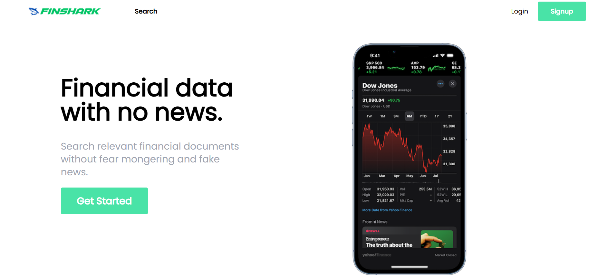

# FinShark

FinShark is a fullstack finance application designed to help users manage their portfolios, track stock prices, create personal watchlists, and stay updated with the latest financial news. Built with React for the frontend and .NET for the backend, FinShark delivers a seamless and efficient user experience.

---

## Features

### User Authentication
- **Login & Signup**: Secure user authentication to protect personal data.

### Portfolio Management
- Add, update, and track your investment portfolios.
- Visualize your portfolio performance with interactive charts.

### Stock Price Tracking
- Real-time stock price updates.
- Detailed stock analysis and performance history.

### Personal Watchlists
- Create and manage custom lists of your favorite stocks or financial instruments.

### Financial News
- Stay informed with the latest financial news curated from top sources.

### Interactive Charts
- Visualize data with charts for better insights.
- View portfolio trends, stock movements, and more.

---

## Technologies Used

### Frontend
- **React**: Modern JavaScript library for building user interfaces.
- **Chart.js**: For rendering interactive and responsive charts.
- **Axios**: To fetch stock prices and news from APIs.

### Backend
- **.NET**: Backend framework to handle API requests and manage data.
- **Entity Framework Core**: For database interactions.

### Database
- **SQL Server**: Stores user data, portfolios, and stock information.

---

## Installation

### Prerequisites
- **Node.js** (for the frontend): [Download Node.js](https://nodejs.org)
- **.NET SDK** (for the backend): [Download .NET SDK](https://dotnet.microsoft.com/download)
- **SQL Server** (for the database): [Download SQL Server](https://www.microsoft.com/en-us/sql-server)

### Steps

#### 1. Clone the repository
```bash
git clone https://github.com/your-username/finshark.git
cd finshark
```

#### 2. Set up the Backend
```bash
cd api
# Install dependencies
 dotnet restore
# Run the backend server
 dotnet run
```

#### 3. Set up the Frontend
```bash
cd client
# Install dependencies
npm install
# Start the React development server
npm start
```

---

## Screenshots

Here is a preview of the application:




---

## Roadmap
- **Integration with third-party APIs** for advanced stock analytics.
- **Dark Mode**: User preference for light and dark themes.
- **Mobile Optimization**: Enhance usability on mobile devices.
- **Advanced Notifications**: Alerts for stock price changes and news updates.

---

## Contributing
We welcome contributions! To contribute:
1. Fork the repository.
2. Create a new branch (`feature/new-feature-name`).
3. Commit your changes.
4. Open a pull request.

---

## License
This project is licensed under the MIT License. See the [LICENSE](LICENSE) file for more details.

---

## Contact
For questions or feedback, please contact us at [veerendragumate@gmail.com](veerendragumate@gmail.com).
